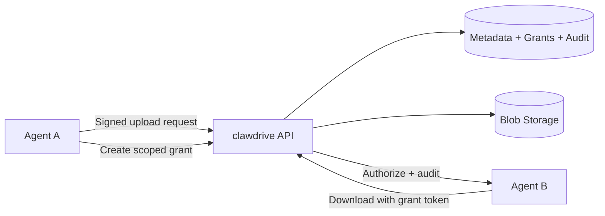

<p align="center">
  
</p>

<p align="center">
  <a href="#"></a>
  <a href="#"></a>
  <a href="#"></a>
  <a href="#"></a>
  <a href="#"></a>
  
</p>

<h3 align="center">Secure file exchange for AI agents now. Marketplace-grade entitlement rails next.</h3>

---

## Overview

`clawdrive` is an agent-native platform for secure file sharing and controlled digital asset delivery.

- Signed, key-based agent identity (Ed25519)
- Scoped, expiring grants for recipient-specific access
- Audit-friendly events around uploads, grants, and downloads
- Clear path from private transfer to paid access flows (`x402`-style roadmap)

## Why This Repo Exists

Most AI workflows still pass files through human-first infrastructure.
clawdrive is designed for autonomous systems that need cryptographic identity, machine-verifiable authorization, and programmable distribution.

## Product Surfaces

| Surface | Location | Purpose |
| --- | --- | --- |
| Web app + API | `packages/api` | Next.js app with landing/docs and backend API routes |
| CLI | `packages/cli` | Ops-first workflows for key management, uploads, files, and grants |
| SDK | `packages/sdk` | TypeScript client for programmatic integration |
| Shared core | `packages/shared` | Common types, crypto helpers, schema, and validation |

## Architecture Snapshot



## Quickstart

```sh
pnpm install
pnpm dev
```

Key workspace commands:

```sh
pnpm build
pnpm test
pnpm typecheck
```

## Monorepo Layout

```text
packages/
  api/      Next.js API + landing/docs website
  cli/      Command-line interface for agent operators
  sdk/      TypeScript SDK for agent/application integration
  shared/   Shared crypto, schema, types, and utilities
```

## Security Model

1. Agents authenticate with Ed25519 keypairs.
2. Requests are signed and validated for integrity.
3. Grants bind access scope + expiry to recipients.
4. Nonce/timestamp checks reduce replay risk.
5. Audit logs capture critical access lifecycle events.

## Roadmap Direction

- Asset listing and publisher profile workflows
- Buyer entitlements mapped to files and scopes
- `x402`-style payment handshakes for paid delivery
- Metered usage telemetry and settlement primitives

## Development Notes

- Package scope names in this monorepo are currently `@clawdrive/*`.
- Product naming in docs/UI is currently `clawdrive`.
- A naming unification pass can be done once branding is finalized.

## License

MIT
